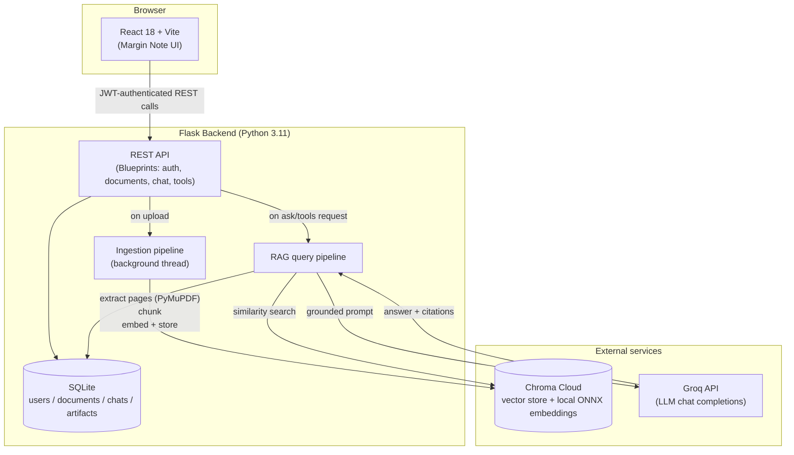

# QueryDoc AI — AI-Powered PDF Knowledge Extraction System

QueryDoc AI lets a user upload a PDF and then ask it questions in plain English. Every answer is grounded in the document itself and cites the exact page it came from — it does not hallucinate facts that aren't in the file. It also generates a summary, a glossary of key terms, and structured study notes for the document on demand.

This is a Retrieval-Augmented Generation (RAG) system: the PDF is split into overlapping chunks, embedded into a vector database, and the most relevant chunks are retrieved and handed to an LLM as grounding context for every question.

## Why RAG, and why these specific choices

A large language model does not know the contents of a PDF a user just uploaded — it was not in its training data. RAG solves this by retrieving the most *relevant* pieces of the document at question time and feeding them to the model as context, so the model answers from the actual text instead of guessing.

- **PyMuPDF** for extraction because it preserves page numbers, which is what makes citations (`p. 14`) possible — a naive "dump all text" approach loses that structure.
- **Chroma's local embedding model** (not an OpenAI/Gemini embedding API) because embeddings are needed for every chunk of every upload, and a local ONNX model keeps the project free to run and demo without a second paid API.
- **Groq** for the LLM call because it is free-tier friendly and fast, which matters for a live demo/viva where waiting 10+ seconds per answer would hurt the presentation.
- **SQLite + threading, not Postgres + Celery/Redis** because this is a single-user demo project meant to run on one laptop with two terminal windows, not a production multi-tenant service. A background `threading.Thread` is enough to keep PDF ingestion from blocking the upload request.

## Architecture



### Request flow: asking a question

1. User uploads a PDF → saved to `uploads/{user_id}/{uuid}.pdf`, a `Document` row is created with `status="processing"`, and a background thread starts.
2. The background thread extracts text page-by-page with PyMuPDF, rejects the file if fewer than 200 characters were extracted (a strong signal it's a scanned/image-only PDF with no text layer), splits the text into 250-word chunks with 50-word overlap (never crossing a page boundary), and stores the chunks in a Chroma collection named `doc_{document_id}` using Chroma's built-in local embedding function. The frontend polls `GET /api/documents/:id` every 2 seconds until `status` becomes `ready` or `failed`.
3. When the user asks a question, the backend embeds the question implicitly via Chroma's query API, retrieves the top 5 most similar chunks, prefixes each with `[Page N]`, and sends them plus the last 4 conversation messages to Groq with a system prompt that instructs the model to answer *only* from the provided context and cite pages.
4. The answer and its source pages/snippets are saved as `Message` rows and returned to the frontend, which renders the answer with a colored left border and citation pills like `p. 14`.

## Tech stack

| Layer | Technology | Why |
|---|---|---|
| Backend framework | Flask 3 (application factory + Blueprints) | Lightweight, explicit, easy to explain in a viva — no hidden magic |
| Database | SQLite via Flask-SQLAlchemy | Zero setup, file-based, fine for a single-user demo |
| Auth | Flask-JWT-Extended | Stateless auth, no server-side session store needed |
| PDF parsing | PyMuPDF (`fitz`) | Fast, page-aware text extraction |
| Vector database | Chroma Cloud (`chromadb` v2 client) | Free tier, managed, no local vector DB server to run |
| Embeddings | Chroma's `DefaultEmbeddingFunction` (local ONNX MiniLM) | Runs on-device, no separate paid embedding API |
| LLM | Groq API (`groq` SDK) | Free-tier, very low latency — good for live demos |
| Frontend framework | React 18 + Vite | Fast dev server, plain JSX (no TypeScript) |
| Routing | react-router-dom v6 | Standard SPA routing |
| HTTP client | axios | Interceptors for JWT injection + error unwrapping |
| Styling | Tailwind CSS (custom "Margin Note" design system) | Utility-first, no separate CSS files per component |
| Icons | lucide-react | Lightweight, consistent icon set |
| Markdown rendering | react-markdown | Renders LLM answers/summaries which come back as Markdown |

No Docker, no Kubernetes, no Redis, no Celery, no Postgres, and no paid API beyond the two free-tier services above (Chroma Cloud, Groq).

## Project structure

```
documind/
├── backend/
│   ├── app/
│   │   ├── __init__.py          # app factory, error handlers
│   │   ├── config.py            # env-driven config + fail-fast validation
│   │   ├── extensions.py        # db, jwt, cors instances
│   │   ├── models.py            # User, Document, ChatSession, Message, Artifact
│   │   ├── utils.py             # ok()/fail() JSON response helpers
│   │   ├── routes/               # auth, documents, chat, tools blueprints
│   │   └── services/
│   │       ├── pdf_service.py    # PyMuPDF text extraction
│   │       ├── chunker.py        # 250-word / 50-word-overlap chunking
│   │       ├── vector_store.py   # Chroma Cloud client + collection ops
│   │       ├── ingestion.py      # background ingestion pipeline
│   │       └── llm_service.py    # Groq prompts for QA / summary / keywords / notes
│   ├── seed_demo.py              # creates a demo login for reviewers
│   ├── run.py                    # entrypoint
│   ├── requirements.txt
│   ├── .env.example              # committed template, no real secrets
│   └── .env                      # real secrets, gitignored
└── frontend/
    ├── src/
    │   ├── api/                  # axios instance + one module per resource
    │   ├── components/           # UploadZone, ChatPanel, ToolsPanel, etc.
    │   ├── context/               # AuthContext, ToastContext
    │   ├── pages/                 # Login, Register, Dashboard, Workspace, NotFound
    │   └── App.jsx
    ├── tailwind.config.js         # Margin Note design tokens
    └── package.json
```

## Setup

Requires Python 3.10+ and Node.js 18+.

### 1. Backend

```bash
cd documind/backend
python -m venv venv

# Windows
venv\Scripts\activate
# macOS/Linux
source venv/bin/activate

pip install -r requirements.txt

copy .env.example .env      # Windows
# cp .env.example .env      # macOS/Linux
```

Open `.env` and fill in the values described in the table below, then:

```bash
python seed_demo.py   # optional: creates demo@documind.ai / demo1234
python run.py
```

The API now runs at `http://127.0.0.1:5000`.

### 2. Frontend

In a second terminal:

```bash
cd documind/frontend
npm install
copy .env.example .env      # Windows
# cp .env.example .env      # macOS/Linux
npm run dev
```

The app now runs at `http://localhost:5173`.

### 3. Use it

Open `http://localhost:5173`, register an account (or log in with the seeded demo account), upload a PDF, wait for it to finish processing, and start asking questions.

## Environment variables

### Backend (`backend/.env`)

| Variable | Required | Default | Description |
|---|---|---|---|
| `FLASK_ENV` | No | `development` | Flask environment name |
| `SECRET_KEY` | **Yes** | — | Flask session/signing secret — generate any random string |
| `JWT_SECRET_KEY` | **Yes** | — | Signing key for JWT access tokens — generate any random string |
| `DATABASE_URL` | No | `sqlite:///documind.db` | SQLAlchemy database URI |
| `UPLOAD_FOLDER` | No | `uploads` | Where uploaded PDFs are stored on disk |
| `MAX_UPLOAD_MB` | No | `20` | Max upload size in megabytes |
| `CHROMA_API_KEY` | **Yes** | — | Chroma Cloud API key ([trychroma.com](https://www.trychroma.com/) — free tier) |
| `CHROMA_TENANT` | **Yes** | — | Chroma Cloud tenant ID |
| `CHROMA_DATABASE` | **Yes** | — | Chroma Cloud database name |
| `GROQ_API_KEY` | **Yes** | — | Groq API key ([console.groq.com](https://console.groq.com/) — free tier) |
| `GROQ_MODEL` | No | `llama-3.3-70b-versatile` | Groq model name. Groq periodically deprecates model names — if you get a "model not found" error, check [console.groq.com/docs/models](https://console.groq.com/docs/models) and update this value. The app returns a clean JSON error telling you to do this rather than crashing. |

Missing any required variable causes the app to refuse to start, with a message listing exactly which ones are missing — it will never silently run with a broken config.

### Frontend (`frontend/.env`)

| Variable | Required | Default | Description |
|---|---|---|---|
| `VITE_API_URL` | No | `http://127.0.0.1:5000/api` | Base URL the frontend calls for the backend API |

## API reference

All responses share the shape `{ "success": bool, "data": ... | null, "error": string | null }`. Endpoints marked 🔒 require `Authorization: Bearer <token>` and are scoped to the requesting user's own resources (accessing another user's document returns `404`, not `403`, so as not to reveal that the resource exists).

| Method | Endpoint | Description |
|---|---|---|
| POST | `/api/auth/register` | Create an account, returns a JWT |
| POST | `/api/auth/login` | Log in, returns a JWT |
| GET | `/api/auth/me` 🔒 | Get the current user's profile |
| POST | `/api/documents/upload` 🔒 | Upload a PDF; starts background ingestion |
| GET | `/api/documents` 🔒 | List the current user's documents |
| GET | `/api/documents/:id` 🔒 | Get one document (used for status polling) |
| DELETE | `/api/documents/:id` 🔒 | Delete a document: its Chroma collection, the file on disk, and all DB rows (chats, artifacts) |
| POST | `/api/chat/:id/ask` 🔒 | Ask a question about a ready document; returns `{ answer, sources }` |
| GET | `/api/chat/:id/history` 🔒 | Get the full chat history for a document |
| POST | `/api/tools/:id/summary` 🔒 | Get (or generate and cache) a summary |
| POST | `/api/tools/:id/keywords` 🔒 | Get (or generate and cache) key terms + definitions |
| POST | `/api/tools/:id/notes` 🔒 | Get (or generate and cache) structured study notes |

## Design system: "Margin Note"

The UI is styled to look like annotations in the margin of a printed page — warm paper tones, a serif heading font (Newsreader), thin 1px rule lines instead of shadows, and no gradients or glassmorphism. Chat answers get a 3px colored left border like a highlighted passage, and citations render as small monospace pills (`p. 14`) rather than plain text, to visually separate "what the AI said" from "where it came from."

## Known limitations

- Scanned/image-only PDFs with no text layer are rejected at upload time with a clear error, rather than silently producing empty answers — OCR is out of scope for this project.
- Chat history is one continuous thread per document rather than multiple named conversations, to keep the data model simple.
- Since this runs on a single process with an in-memory thread per upload, restarting the backend mid-ingestion leaves that one document stuck in `processing` — it would need to be deleted and re-uploaded.
